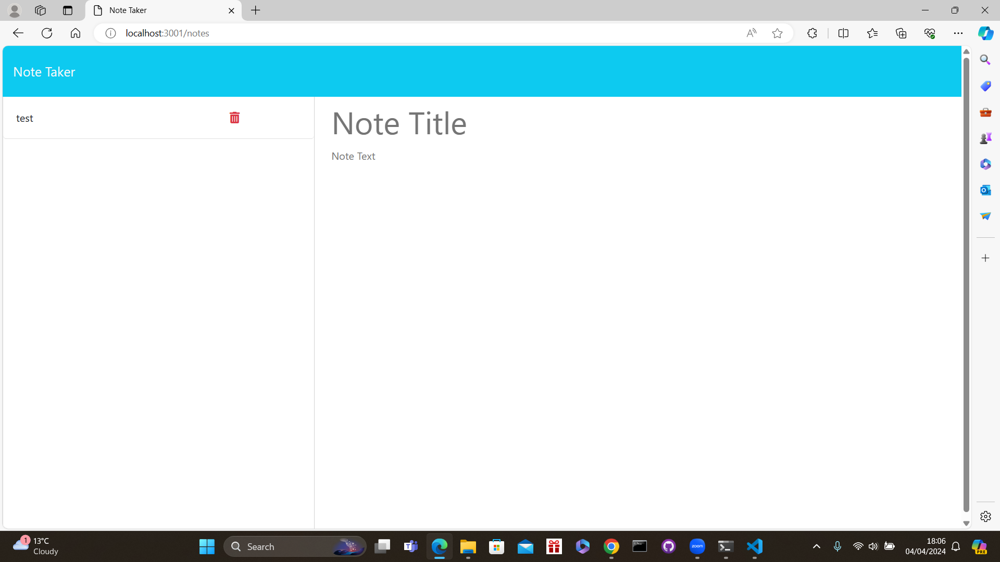

# 11th-Challenge-Note-Taker

## What was my objective and what have I accomplished?
In this project i was tasked with creating a full functioning note taking website which i have sucessfully been able to do by ensuring that when the user loads up the page via the "Node Server.js" function they are then able to click on the URL provided which will take the user to the starting page which allows them to then click on the notes button they are then taken to the notes page which allows the user to add, delete and view any notes that they need to.

In addition if the user wishes to clear off a note without saving or deleting they can then press the clear button at the top of the page which will fully clear their added note if need be. Once the user is viewing an old note they are then able to click the new note button on the top right of the page which will then show them a new blank template so that they can then add in a new note

https://one1th-challenge-note-taker-5.onrender.com
